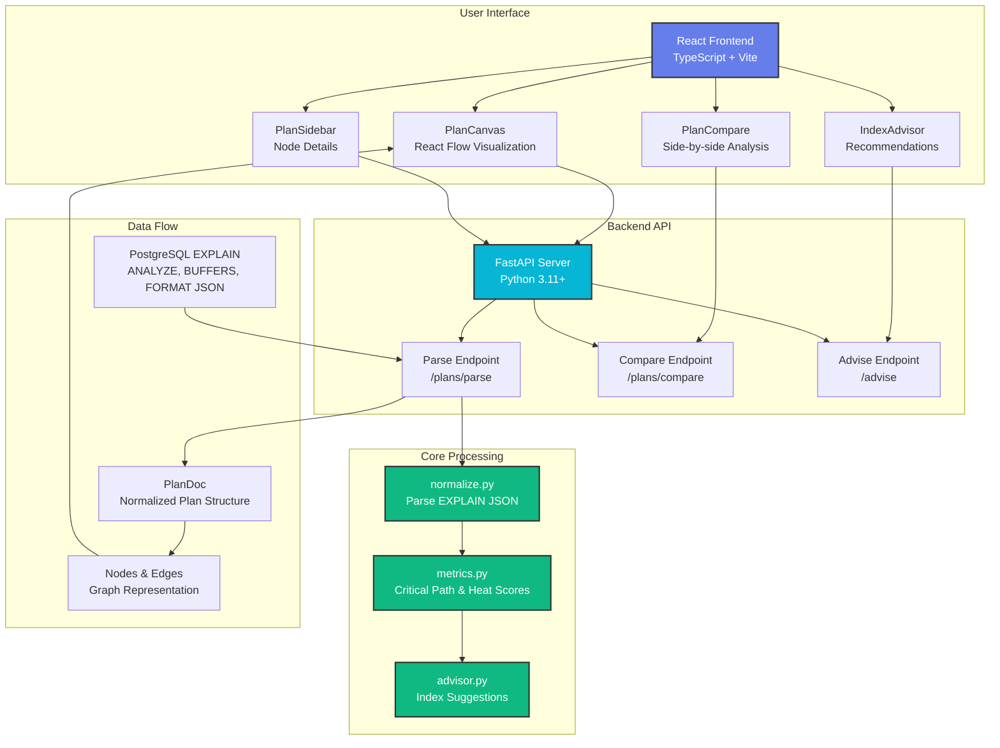
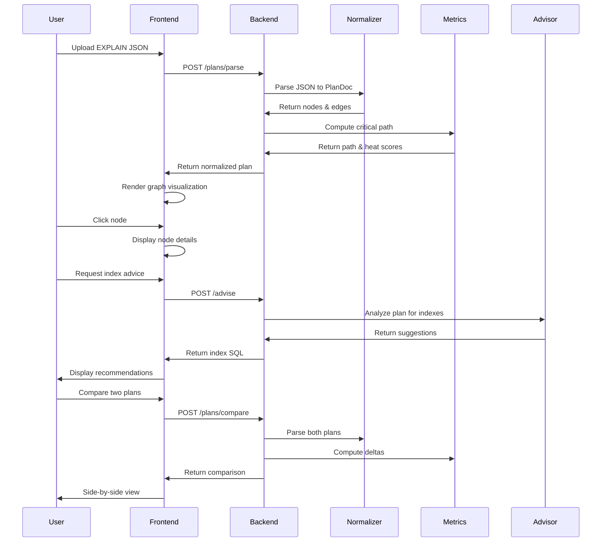
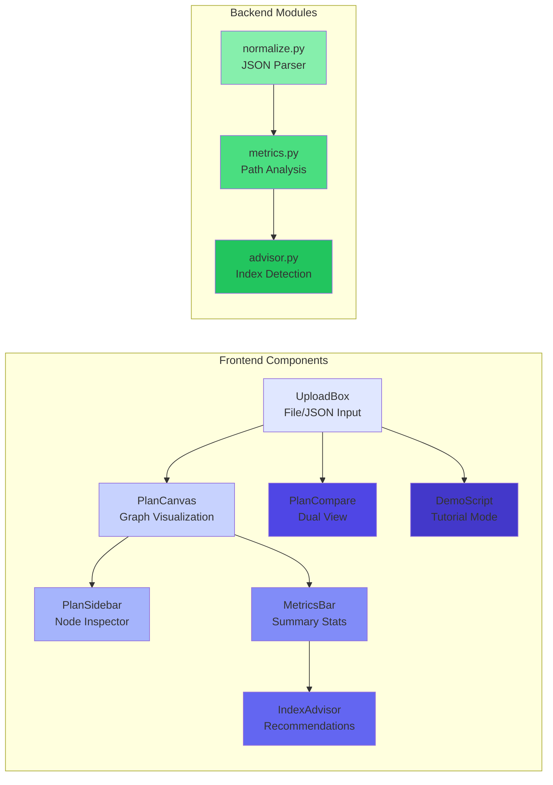

# Visual SQL Plan Explorer

## Project Overview

This is a learning project implemented in a personal capacity to explore PostgreSQL query optimization and web application development. The tool transforms PostgreSQL query execution plans into interactive visualizations, helping developers understand query performance characteristics.

## Architecture Diagram



## Workflow Diagram



## System Components



## About

Visual SQL Plan Explorer is a learning project designed to transform PostgreSQL query execution plans into actionable performance insights. Built with FastAPI and React, the tool parses `EXPLAIN (ANALYZE, BUFFERS, FORMAT JSON)` output and provides interactive visualizations, automated bottleneck detection, and intelligent index recommendations.

The application implements graph-based algorithms to compute critical execution paths, heat scores for performance hotspots, and pattern-matching heuristics to identify missing indexes. The frontend leverages React Flow for interactive plan exploration, while the backend uses Pydantic models for type-safe plan normalization and metric computation.

This project serves as an educational exploration of database query optimization, web application architecture, and data visualization techniques.

## Features

- **Interactive Plan Visualization** - Drag, zoom, and explore query plans with React Flow graph visualization
- **Critical Path Analysis** - Automatic identification and highlighting of the slowest execution path through the plan tree
- **Heatmap Visualization** - Color-coded nodes showing performance hotspots based on execution time, buffer reads, and row estimation accuracy
- **Performance Metrics Dashboard** - Real-time display of total execution time, cost, row counts, and warning summaries
- **Index Advisor** - Intelligent suggestions for missing indexes with ready-to-use SQL statements
- **Plan Comparison** - Side-by-side comparison of query plans with performance deltas and diff annotations
- **Demo Mode** - Interactive demonstration with pre-loaded sample plans showcasing optimization scenarios
- **Presentation Mode** - Clean, enlarged interface optimized for demos and technical presentations
- **Node Detail Inspector** - Click any plan node to view detailed execution metrics, buffer statistics, and warnings
- **Automatic Warning Detection** - Identifies common performance issues including sequential scans, high buffer reads, and row estimation errors
- **Responsive Design** - Works seamlessly on desktop, tablet, and mobile devices

## Quick Start

### Using Docker (Recommended)

```bash
# Clone the repository
git clone https://github.com/your-username/visual-sql-plan-explorer.git
cd visual-sql-plan-explorer

# Start all services
make up

# Load demo data (optional)
make load-demo

# Open the application
open http://localhost:5173
```

### Manual Setup

#### Backend (Python/FastAPI)

```bash
cd backend
pip install -e .
uvicorn app.main:app --reload --port 8000
```

#### Frontend (React/Vite)

```bash
cd frontend
npm install
npm run dev
```

#### Database (PostgreSQL)

```bash
# Start PostgreSQL
docker run -d \
  --name postgres-demo \
  -e POSTGRES_DB=plans \
  -e POSTGRES_USER=dev \
  -e POSTGRES_PASSWORD=dev \
  -p 5432:5432 \
  postgres:16

# Load sample data
psql -h localhost -U dev -d plans -f scripts/seed.sql
```

## Usage

### 1. Upload Query Plan

**Option A: Upload JSON File**
- Drag and drop your PostgreSQL `EXPLAIN` JSON output
- Or click to select a file

**Option B: Paste JSON**
- Copy your `EXPLAIN (ANALYZE, BUFFERS, FORMAT JSON)` output
- Paste directly into the text area

### 2. Analyze the Plan

- **Heatmap**: Red nodes indicate performance bottlenecks
- **Critical Path**: Highlighted path shows the slowest execution route
- **Node Details**: Click any node to see detailed metrics in the sidebar
- **Warnings**: Automatic detection of common performance issues

### 3. Get Index Recommendations

- Click the "Index Advisor" section
- Review suggested indexes with SQL statements
- Copy SQL to clipboard with one click
- Apply suggestions to your database

### 4. Compare Plans

- Switch to "Compare Plans" mode
- Upload two different query plans
- See side-by-side comparison with performance deltas
- Identify improvements or regressions

## Demo Mode

Try the interactive demo with pre-loaded sample plans:

1. Click "Demo Mode" in the header
2. Navigate through the 3-step demonstration:
   - **Step 1**: Sequential scan problem
   - **Step 2**: Missing index detection
   - **Step 3**: Performance after optimization

## Sample Queries

The repository includes sample queries in `scripts/demo_queries.sql`:

```sql
-- Sequential scan with filter
EXPLAIN (ANALYZE, BUFFERS, FORMAT JSON)
SELECT * FROM customers WHERE city = 'New York' AND status = 'active';

-- Join without proper indexes
EXPLAIN (ANALYZE, BUFFERS, FORMAT JSON)
SELECT c.name, o.total_amount
FROM customers c
JOIN orders o ON c.id = o.customer_id
WHERE c.city = 'Los Angeles';
```

## Architecture

### Backend (Python/FastAPI)
- **FastAPI** - Modern, fast web framework
- **Pydantic** - Data validation and serialization
- **Core Modules**:
  - `normalize.py` - Parse PostgreSQL EXPLAIN JSON
  - `metrics.py` - Calculate critical path and heat scores
  - `advisor.py` - Generate index suggestions

### Frontend (React/TypeScript)
- **React 18** - Modern React with hooks
- **React Flow** - Interactive graph visualization
- **TanStack Table** - Data grid components
- **Vite** - Fast build tool and dev server

### Key Components
- `PlanCanvas` - Interactive plan visualization
- `PlanSidebar` - Node details and metrics
- `IndexAdvisor` - Index recommendation engine
- `PlanCompare` - Side-by-side plan comparison
- `DemoScript` - Interactive demonstration mode

## API Endpoints

### POST `/plans/parse`
Parse PostgreSQL EXPLAIN JSON into normalized format.

**Request:**
```json
{
  "rawExplainJson": { /* PostgreSQL EXPLAIN JSON */ }
}
```

**Response:**
```json
{
  "id": "uuid",
  "summary": {
    "totalTimeMs": 1500.0,
    "totalCost": 10000.0,
    "totalRows": 50000,
    "warnings": ["High shared read", "Sequential scan detected"]
  },
  "nodes": [ /* Plan nodes */ ],
  "edges": [ /* Plan edges */ ],
  "critical_path": ["node1", "node2"],
  "warnings": []
}
```

### POST `/plans/compare`
Compare two query plans and compute deltas.

### POST `/advise`
Generate index suggestions for a query plan.

## Development

### Prerequisites
- Python 3.11+
- Node.js 18+
- PostgreSQL 16+

### Setup Development Environment

```bash
# Install pre-commit hooks
pre-commit install

# Backend development
cd backend
pip install -e ".[dev]"
pytest

# Frontend development
cd frontend
npm install
npm run lint
```

### Available Commands

```bash
make up          # Start all services
make down        # Stop all services
make test        # Run tests
make fmt         # Format code
make lint        # Lint code
make load-demo   # Load demo data
make clean       # Clean up containers and volumes
```

## Contributing

1. Fork the repository
2. Create a feature branch: `git checkout -b feature/amazing-feature`
3. Commit changes: `git commit -m 'Add amazing feature'`
4. Push to branch: `git push origin feature/amazing-feature`
5. Open a Pull Request

### Development Guidelines

- Follow PEP 8 for Python code
- Use TypeScript for all frontend code
- Write tests for new features
- Update documentation for API changes
- Use conventional commit messages

## License

This project is licensed under the MIT License - see the [LICENSE](LICENSE) file for details.

## Acknowledgments

- PostgreSQL community for excellent documentation
- React Flow team for the amazing graph visualization library
- FastAPI team for the modern Python web framework

## Roadmap

- [ ] Support for more database systems (MySQL, SQL Server)
- [ ] Query plan history and versioning
- [ ] Automated performance regression detection
- [ ] Integration with monitoring tools
- [ ] Advanced index recommendation algorithms
- [ ] Query plan sharing and collaboration features

---

Built for the PostgreSQL community
